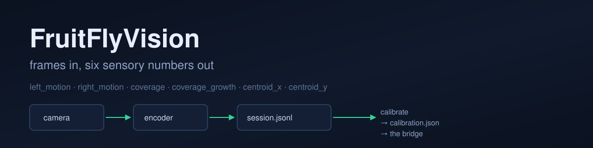

<div align="center">



# FruitFlyVision

**The front end: camera frames in, six sensory numbers out.**


[](LICENSE)


[Quick start](#quick-start) · [Channels](#the-six-channels) · [Calibration](#calibration) · [Limitations](#current-limitations)

</div>

This package is the eye of the [fruitfly-brain](https://github.com/fruitflyxyz/fruitfly-brain)
bridge, extracted so it can be used, tested and calibrated on its own. Point it at
a synthetic sweep, a webcam or a video file and it writes a stream of small,
versioned sensory packets — the same numbers the bridge consumes, in a format you
can replay later.

It deliberately does not classify anything. No detections, no tracking, no
labels. Six numbers per frame, each with a name, a unit and a documented failure
mode.

**Thirty seconds, no hardware:**

```bash
python examples/sweep_demo.py
```

## What it does

- **Three sources** behind one interface: synthetic (deterministic, configurable),
  webcam, video file.
- **Six channels** per frame: left motion, right motion, coverage, coverage
  growth, centroid x/y. The frame timestamp (`t_ms`) rides alongside them but is
  not a channel — a clock is not a sensation.
- **Calibration** from a recorded session: estimates the noise floor of a quiet
  scene and the gain that maps a known sweep to the expected units.
- **Packet export**: JSONL, one packet per line, read back with `fruitfly-vision
  summary`, and parseable by anything that understands JSON.
- **ASCII channel view** for a terminal on a robot, and an optional matplotlib
  plot.
- **Strict validation** on both write and read: an unknown channel or a
  non-finite value is an error, not a silently skipped line.

## The six channels

| channel | unit | what it means | how it fails |
|---|---|---|---|
| `left_motion` | 0..8 | mean optical-flow magnitude in the left half | reads global exposure changes as motion |
| `right_motion` | 0..8 | same, right half | same |
| `coverage` | 0..1 | fraction of pixels above the midpoint of the frame's range | fooled by a high-contrast vignette |
| `coverage_growth` | -8..8 | change in `coverage` since the previous frame | fires on auto-exposure steps |
| `centroid_x` | -1..1 | brightest-blob centre, normalised to the frame | drifts on a scene with two similar blobs |
| `centroid_y` | -1..1 | same, vertically | same |

Frame time is kept as `t_ms` alongside the channels; it is not a channel, because
a clock is not a sensation. See [docs/ARCHITECTURE.md](docs/ARCHITECTURE.md) for
the transform pipeline and [docs/VALIDATION.md](docs/VALIDATION.md) for the
measurements behind the numbers in the "how it fails" column.

## Quick start

```bash
git clone https://github.com/fruitflyxyz/fruitfly-vision.git
cd fruitfly-vision
python3.11 -m venv .venv
source .venv/bin/activate
pip install -e ".[dev]"

fruitfly-vision run --source synthetic --frames 240 --export session.jsonl
fruitfly-vision summary session.jsonl
```

```text
session.jsonl  240 packets  (8.0 s at 30 fps)
left_motion      min  +0.000  max  +1.500  mean  +0.827
right_motion     min  +0.000  max  +1.500  mean  +0.644
coverage         min  +0.019  max  +0.020  mean  +0.019
coverage_growth  min  -0.006  max  +0.006  mean  -0.000
centroid_x       min  -0.843  max  +0.830  mean  -0.074
centroid_y       min  -0.004  max  -0.002  mean  -0.003
```

## Sources

```bash
fruitfly-vision run --source synthetic --sweep both --frames 240
fruitfly-vision run --source webcam --camera 0 --frames 300
fruitfly-vision run --source video --video clip.mp4 --frames 600
```

The synthetic source is a scene generator with named knobs (`--speed`,
`--blob-radius`, `--blob-drift`, `--loom-every`, `--noise`, `--seed`), plus five
presets to pick from with `--sweep`. It exists
so a test can say "a blob moving right at 3 px per frame must produce a larger
`right_motion` than `left_motion`" and mean it. It is not a physics simulator:
there is no 3D, no lighting model and no motion blur.

## Calibration

```bash
fruitfly-vision run --source synthetic --sweep quiet --frames 120 --export quiet.jsonl
fruitfly-vision run --source synthetic --sweep right --frames 120 --export right.jsonl
fruitfly-vision calibrate quiet.jsonl right.jsonl --out calibration.json
fruitfly-vision run --source webcam --calibration calibration.json --frames 120
```

`calibrate` writes the measured noise floor, the observed per-axis gain and a
suggested threshold set. It refuses to guess when a session is too short (fewer
than 30 packets) or too quiet (no motion above the floor) and says so in the
terminal instead of writing a file full of ones. The maths and the two refusals
are covered in [docs/CALIBRATION.md](docs/CALIBRATION.md).

## Packets

One JSON object per line, `spec_version` first so a reader can refuse a format it
does not know:

```json
{"spec_version":"1.0","frame":42,"t_ms":1400.0,"source":"synthetic",
 "channels":{"left_motion":0.31,"right_motion":2.88,"coverage":0.078,
 "coverage_growth":0.004,"centroid_x":0.42,"centroid_y":-0.03}}
```

## Current limitations

- **No absolute scale.** Channels are relative to the frame, not calibrated in
  physical units. Two cameras with different fields of view produce the same
  numbers for the same motion only after calibration.
- **No background model.** A moving camera produces motion everywhere, which is
  the correct reading of the pixels and the wrong reading of the world.
- **No temporal filter.** One reading per frame, no smoothing, no hysteresis.
  Whoever consumes the packet decides how to filter it.
- **Blob centroid assumes one blob.** It is a brightness-weighted average, so two
  similar blobs give a centroid at the midpoint, which is never where either one is.
- **No hardware validation.** Tested against synthetic frames and recorded video,
  not against a real insect, a real camera rig or a real robot.

## Family

- [fruitfly-brain](https://github.com/fruitflyxyz/fruitfly-brain) — the bridge that
  consumes these packets
- [fruitfly-motor](https://github.com/fruitflyxyz/fruitfly-motor) — the actuator side

## License

MIT — see [LICENSE](LICENSE).
